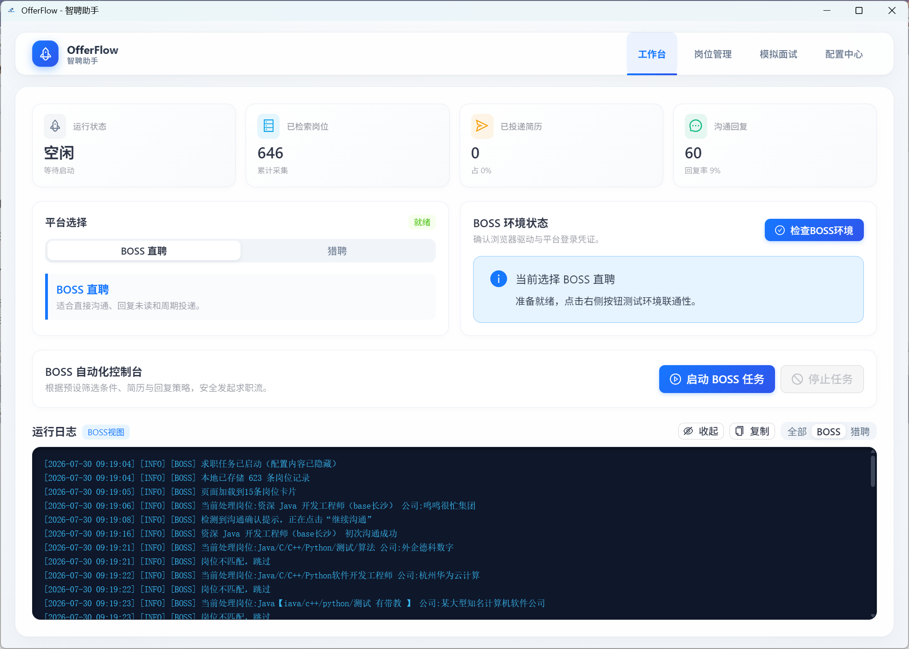
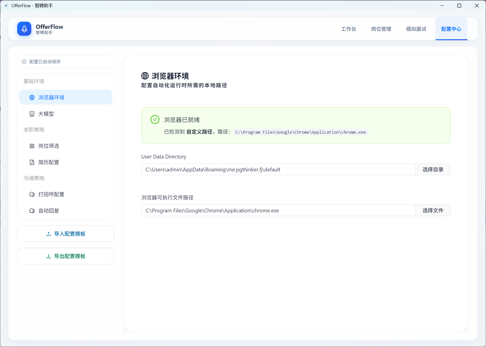
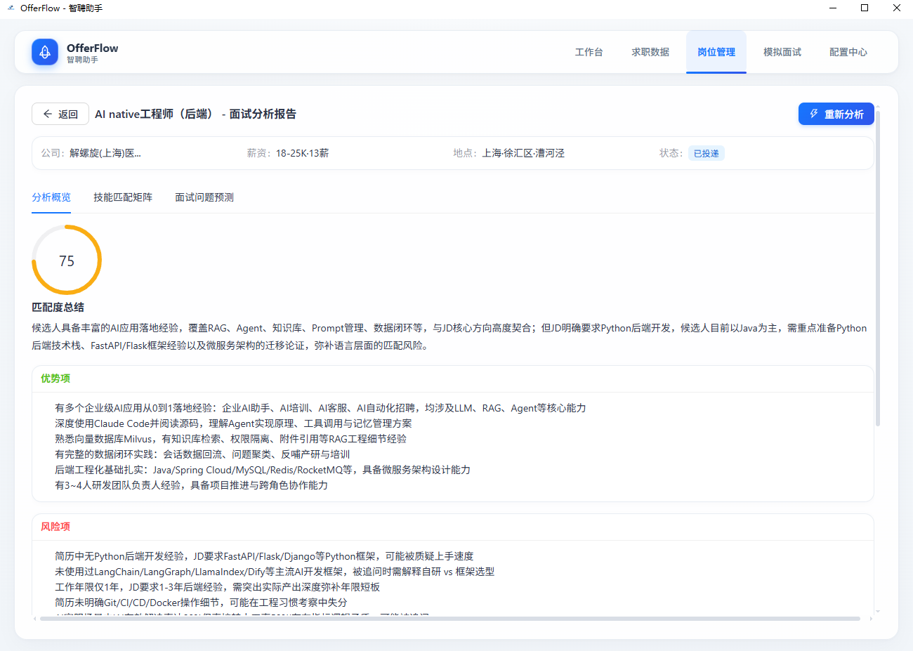
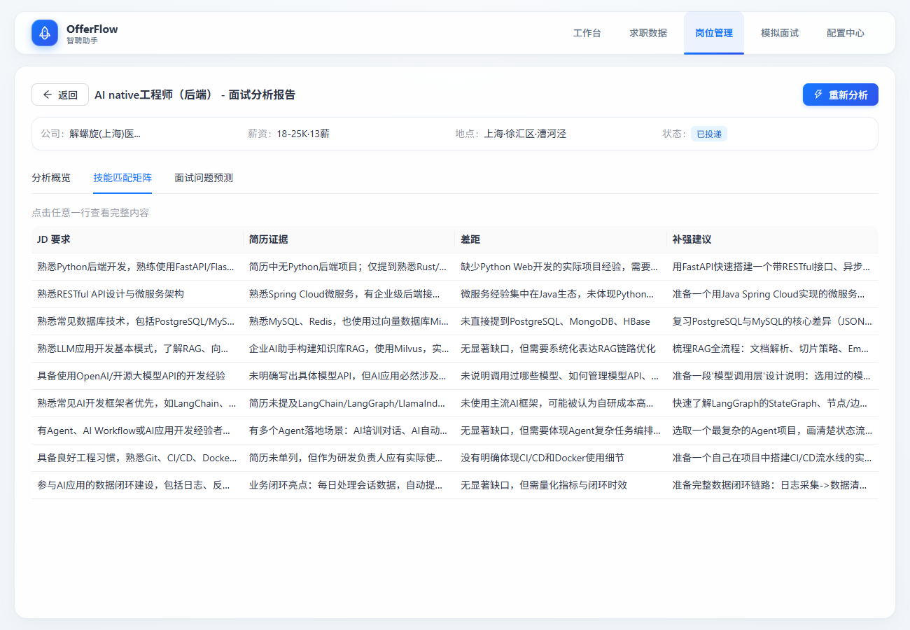
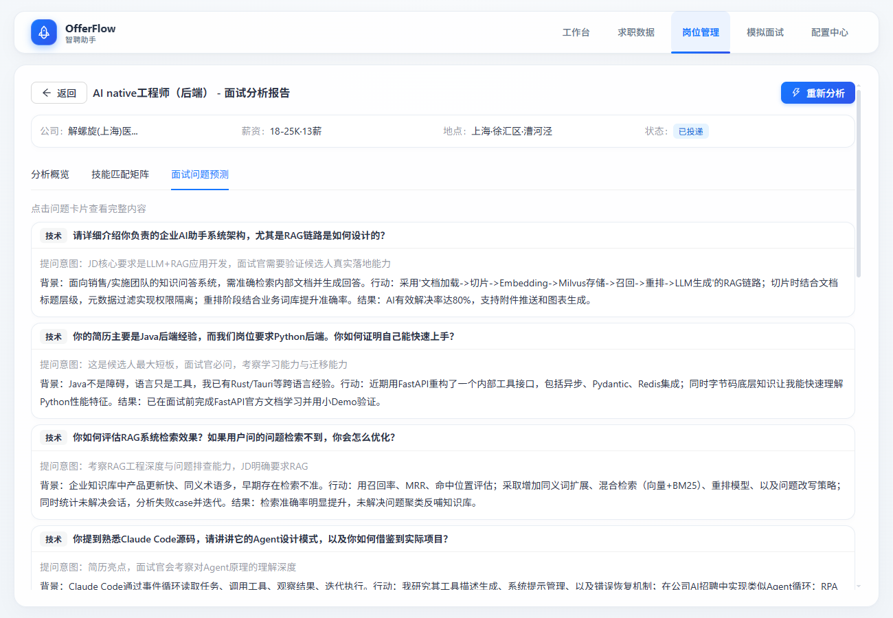
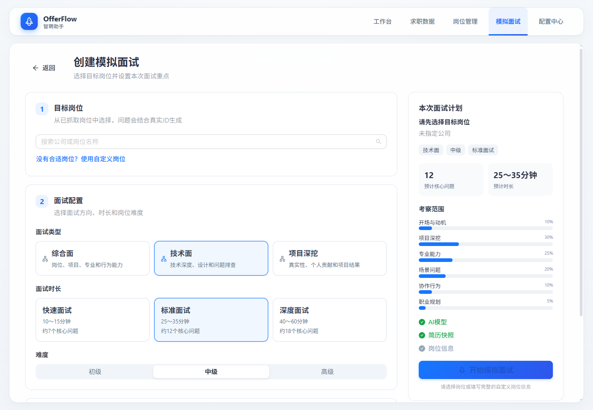
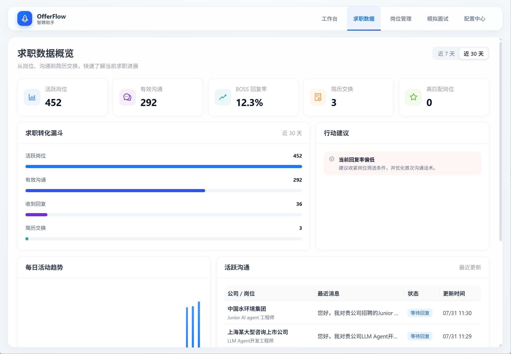
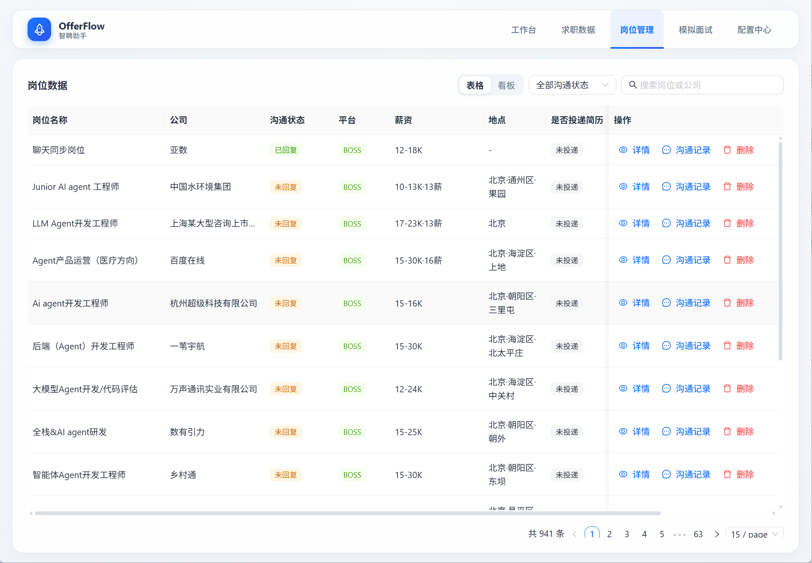

# OfferFlow 🚀

> 本地优先的开源桌面求职自动化与分析工具

[](https://github.com/Ye-feng0510/OfferFlow/blob/master/LICENSE)

**OfferFlow** 是一款基于 [Tauri 2](https://tauri.app/) 构建的跨平台桌面应用，专注于求职流程的自动化与智能化。本应用无需独立账号、无遥测、无云端同步；招聘平台仍需登录，使用远程 AI 时相关上下文会发送给你配置的服务商。

当前独立仓库：[Ye-feng0510/OfferFlow](https://github.com/Ye-feng0510/OfferFlow)。本项目基于 [OpenFuckJob/FuckJob](https://github.com/OpenFuckJob/FuckJob) 衍生开发，感谢上游作者和贡献者；原始版权及 Apache-2.0 许可保留在 [LICENSE](LICENSE) 中。

**发行状态：独立仓库暂未发布安装包，自动更新和自动发布已停用。** 当前请从源码构建；历史发布文档与截图不代表本仓库已有可下载版本。

---

## 🖼️ 界面预览

### 工作台

<p align="center">
  
</p>

<p align="center">
  <sub>统一管理求职平台、自动化任务、运行状态和实时日志</sub>
</p>

### 配置中心

<p align="center">
  
</p>

<p align="center">
  <sub>集中配置浏览器环境、大模型、简历、岗位筛选和沟通策略</sub>
</p>


### 岗位分析

<p align="center">
  
</p>

<p align="center">
  
</p>

<p align="center">
  
</p>

### AI模拟面试


<p align="center">
  
</p>

### 其它

<p align="center">
  
</p>

<p align="center">
  
</p>


---

## ✨ 功能概览

### 🖥️ 工作台
一键自动化求职流程——环境检测、扫码登录、岗位抓取、批量沟通，支持 **BOSS 直聘**和**猎聘**两大平台。

- 自动化浏览器操控，模拟真实用户行为
- 支持单轮/周期求职模式
- 实时日志查看与流程监控
- 可配置的打招呼话术与回复模板

### 📋 岗位管理
集中管理抓取的岗位数据，支持筛选、搜索和 AI 辅助分析。

- 岗位详情浏览与管理
- 薪酬、经验、学历、行业等多维度筛选
- AI 岗位分析与匹配度评估

### 🤖 AI 能力（可选）
兼容 OpenAI 接口的大模型集成，支持：

- **本地模型**：Ollama、LM Studio（数据不出本机）
- **在线服务**：OpenAI、DeepSeek、阿里云 DashScope
- **自定义端点**：任意 OpenAI 兼容 API

AI 功能包括：
- 📝 简历上下文与文字模拟面试（简历优化底层接口尚未接入独立编辑界面）
- 💬 智能打招呼语生成
- 📊 岗位描述分析与匹配
- 🔄 聊天回复自动生成

### ⚙️ 配置中心
灵活可调的求职策略配置：

- **大模型配置**：服务地址、模型选择、API Key（存储于系统钥匙串）
- **简历配置**：多份简历管理与上下文注入
- **岗位筛选**：正则规则过滤，支持 ACCEPT/REJECT 模式
- **沟通话术**：可配置的打招呼模板与回复规则
- **浏览器配置**：Chromium 路径、启动参数等

### 🔒 关于与数据
透明可控的数据管理：

- 应用版本与数据目录查看
- 数据导出备份 / 恢复备份
- 日志清除与模型密钥管理
- 应用配置重置
- 查看 [完整许可](https://github.com/Ye-feng0510/OfferFlow/blob/master/LICENSE)、[隐私与网络文档](https://github.com/Ye-feng0510/OfferFlow/blob/master/docs/privacy-and-network.md)、[模型配置文档](https://github.com/Ye-feng0510/OfferFlow/blob/master/docs/model-configuration.md)

---

## 🛡️ 隐私优先

- ✅ **本地优先**：应用在本机保存配置和业务记录；使用远程 AI 时，相关上下文会发送给所配置服务
- ✅ **无遥测**：不含任何数据收集或上报
- ✅ **无后台服务器**：不依赖原项目业务服务器，无账号体系
- ✅ **凭据安全**：API Key 存储在系统钥匙串/凭据库，不写入配置文件
- ✅ **日志脱敏**：敏感字段（密钥、Token、Cookie 等）自动脱敏
- ✅ **网络边界可审计**：运行 `pnpm check:network` 静态检查已定义的旧服务地址和接口模式（不是完整网络审计）

详见 [隐私与网络边界文档](https://github.com/Ye-feng0510/OfferFlow/blob/master/docs/privacy-and-network.md)。

### 从旧版迁移

OfferFlow 使用独立应用标识 `io.github.ye-feng0510.offerflow` 与系统凭据服务 `offerflow`，不会自动接管旧版数据。首次使用时可明确选择复制支持的旧配置和数据；迁移不删除旧目录或旧密钥。浏览器资料目录全新创建，需要重新登录招聘平台；模拟面试 localStorage、原始 PDF 和图片不在复制范围内。

模型密钥优先使用新凭据库；环境变量使用 `OFFERFLOW_LLM_API_KEY`，并兼容旧的 `FUCKJOB_LLM_API_KEY` 回退。详见 [模型配置](docs/model-configuration.md) 和 [迁移与网络边界](docs/privacy-and-network.md)。

---

## 🛠️ 技术栈

| 层 | 技术 |
|---|---|
| 桌面框架 | [Tauri 2](https://tauri.app/) |
| 前端 | React 19 + TypeScript |
| UI 组件 | Ant Design 6 + Tailwind CSS 4 |
| 构建工具 | Vite 7 |
| 后端 | Rust (rig、rust_drission 等) |
| 测试 | Vitest + Testing Library |
| 包管理 | pnpm |

---

## 📦 快速开始

### 环境要求

- [Rust](https://www.rust-lang.org/) (stable)
- [Node.js](https://nodejs.org/) 22.12+（推荐 Node.js 22 LTS）
- [pnpm](https://pnpm.io/) ≥ 9
- 系统依赖：参考 [Tauri 2 前置要求](https://tauri.app/start/prerequisites/)

### 开发运行

```bash
# 安装依赖
pnpm install

# 启动开发模式
pnpm tauri dev
```

### 本地构建（不会发布）

```bash
pnpm tauri build
```

自动发版工作流目前只能手动显示停用说明，不构建、不上传、不发布。后续启用条件见 [发行与更新状态](docs/updater-release.md)。

### macOS 使用说明

当前没有独立发行安装包，也未配置 Apple 官方签名公证。自行构建并安装至 `/Applications/OfferFlow.app` 后，如确因隔离标记被 Gatekeeper 拦截，仅在确认来源可信时运行：

```bash
xattr -dr com.apple.quarantine /Applications/OfferFlow.app
```

> **提示**：不是所有本机构建都需要此命令；不要对来源不明的软件绕过系统保护。

### 运行测试

```bash
pnpm test:run
```

### 网络边界检查

```bash
pnpm check:network
```

---

## 📁 项目结构

```
OfferFlow/
├── src/                    # React 前端
│   ├── components/         # 通用组件
│   ├── hooks/              # 自定义 Hooks
│   ├── lib/                # 工具函数与常量
│   ├── types/              # TypeScript 类型定义
│   ├── view/               # 页面视图
│   │   ├── workspace/      # 工作台
│   │   ├── job-data/       # 岗位管理
│   │   ├── config/         # 配置中心
│   │   ├── about-data/     # 关于与数据
│   │   ├── resume-optimizer/ # 简历优化
│   │   ├── conversation-debug/ # 沟通调试
│   │   └── onboarding/     # 初次引导
│   └── assets/             # 静态资源
├── src-tauri/              # Rust 后端
│   └── src/
│       ├── rpa/            # 浏览器自动化
│       ├── llm/            # 大模型集成
│       ├── storage/        # 数据持久化
│       └── dao/            # 数据访问层
├── docs/                   # 文档
│   ├── model-configuration.md
│   └── privacy-and-network.md
└── scripts/                # 工具脚本
```

---

## 💬 问题反馈

请在 [OfferFlow Issues](https://github.com/Ye-feng0510/OfferFlow/issues) 反馈问题与建议。本独立仓库不将上游交流群作为自己的支持渠道。

---

## 📄 许可

本项目基于 [Apache License 2.0](https://github.com/Ye-feng0510/OfferFlow/blob/master/LICENSE) 开源，保留上游版权声明。

---

## ⚠️ 免责声明

本工具仅供个人求职辅助用途。使用者应遵守各招聘平台的服务条款，合理使用自动化功能。开发者不对因使用本工具导致的任何账号限制、数据丢失或其他后果承担责任。
